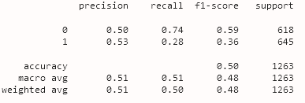
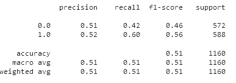
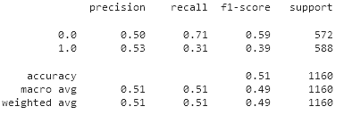

# stockpredictor

The purpose of this project is to predict stock sentiment and price using machine learning models using historical stock data and relevant tweets data.

For the purpose of our analysis foucsed on TSLA stock.

## Additional libraries Required to run the code

**_For sentiment analysis we are using nlp packages vadersentiment & textblob. You can install these pacakges from commandline as below_**

1. pip install vaderSentiment
2. conda install -c conda-forge textblob

**_Deep learning - Tensorflow & Keras_**

1. Tensorflow and keras - to install please visit https://www.tensorflow.org/install

## Data used for predictions and analysis

- To run this code download Resources Company_Tweet.csv & Tweet.csv from kaggle link https://www.kaggle.com/code/saadusama/twitter-s-impact-on-stock-market-prices/data and copy them in Resources folder.  
  **NOTE:** As tweets data files are very large we could not upload them in git as account limit is max 100MB per file 
- TSLA historical stock data is downloaded using GOOGLEFINANCE function and is saved in TSLA.csv, in resources folder

## Code flow

Run **Main.ipynb**, for analysis and results.

Main.ipynb inturn run the following notebooks, in order -

1. **PrepareData.ipynb** - the purpose of this file is to read data from downloaded csv files and create dataframes. This file also run the SentimentAnalysis on the tweets and save the results in dataframes. All dataframes are save in IPython database so that they can be used across notebooks.

2. **Stock_sentiment_predictor_KNN.ipynb** - the purpose of this file is to create a Machine Learning model using K-nearest Neighbors algorithm and analyse it's performance for stock sentiment/direction predictions for given TSLA stock & tweet data.

3. **Stock_direction_predictor_RF.ipynb** - the purpose of this file is to create a Machine Learning model using Random Forest algorithm and analyse it's performance for stock sentiment/direction predictions for given TSLA stock & tweet data.

4. **Stock_price_prediction_LTSM.ipynb** - the purpose of this file is to create a stacked LSTM model that uses deep learning to predict the price and analyse it's performance.

5. We also evaluated fbprophet for stock price prediction. Refer the URL mentioned below for the same  
   https://colab.research.google.com/drive/1R_3ay9-X4SH9mh5xhsan8Vn1nWkWpOwl?usp=sharing

## Analysis Report

### Historical TSLA stock data

The available TSLA data is quiet balanced, but peaking in the end.
<a>TSLA stock historical Close values</a>

### Sentiment Analysis

We used nlp based VaderSentiment and Textblob to evaluate the sentiments from the available tweet data. Overall both of the model gave similar results, but we found VaderSentiment runs much faster than textblob.

For the data used for analysis adding sentiments analysis results as one of the feature used for predictions along with technical indicators did not significantly impacted the performance of the model. Details avaiable in model wise analysis report.

### KNN Model Analysis

#### **Summary**

We tried different premutations and combinations of parameters to optimise our KNN model,by finding the optimal value of n_neighbors for parameters used to train and test the model.
We also evaluated the model by including sentiment analysis based on tweets data along with other features.

If we take the best case scenario from among all tests we did, model predicted with overall accuracy of 51.3%. The model predicted 52% of true negative and 51% of true positive for stock price direction. Below is the classification report for best performing model from among all knn models we created. 

> Optimal value of n_neighbors is 13 
> Balanced accuracy score for the model is 0.5130605345410474 
>
>                   precision    recall  f1-score   support
>
>                0       0.50      0.52      0.51       244
>                1       0.53      0.51      0.52       257
>
>         accuracy                           0.51       501
>        macro avg       0.51      0.51      0.51       501
>     weighted avg       0.51      0.51      0.51       501

#### **Details**

#### **_KNN Model 1_**

Impact of scoring technique used to find n_neighbors on performance of the KNN Model

**Given the data it is observed that performace of KNN model improves, when n_neighbors is set to 1 and test size is 20%. The optimal value of n_neighbors is obtained by using cross validation scoring technique using "recall" score. **

**_Below are the results when optimal value of n_neighbors is obtained by using cross_val_score, with scoring set to "recall"_**

> Optimal value of n_neighbors is 1 
> Balanced accuracy score for the model is 0.5133665506336313 
>
>                   precision    recall  f1-score   support
>
>                0       0.51      0.60      0.55       294
>                1       0.52      0.43      0.47       299
>
>         accuracy                           0.51       593
>        macro avg       0.51      0.51      0.51       593
>     weighted avg       0.51      0.51      0.51       593

**_Below are the results when optimal value of n_neighbors is obtained by using cross_val_score, with scoring set to "accuracy"_**

> Optimal value of n_neighbors is 5   
> Balanced accuracy score for the model is 0.4778513412053784 
>
>                   precision    recall  f1-score   support
>
>                0       0.48      0.55      0.51       294
>                1       0.48      0.40      0.44       299
>
>         accuracy                           0.48       593
>        macro avg       0.48      0.48      0.47       593
>     weighted avg       0.48      0.48      0.47       593

#### **_KNN Model 2_**

Impact of the way training and testing dataset are generated on performance of the KNN Model.

**Given the data it is observed that KNN Model perform better when training & testing datasets are constructed keeping time series nature of the data in mind, which is also the default behaviour of the KNN Model we created. It is observed that when training & testing datasets randomly using train_test_split the performance of our model falls. **

**_Referring to the classification report below,these are the best results that we could achieve when training and testing datasets are generated randomly._**

> Optimal value of n_neighbors is 69 
> Balanced accuracy score for the model is 0.4946751260408996 
>
>                   precision    recall  f1-score   support
>
>                0       0.52      0.45      0.48       139
>                1       0.47      0.54      0.51       127
>
>         accuracy                           0.49       266
>        macro avg       0.49      0.49      0.49       266
>     weighted avg       0.50      0.49      0.49       266

#### **_KNN Model 3_**

Impact of increasing/decreasing test data size on performance of the model.

**As there is a major peak in data on later dates, increasing the training dataset & reducing test data size to 10% from 20% improved the performance of the model\***

**_Referring to the classification report below,these are the best results that we could achieve by increasing the training dataset to 90%._**

> Optimal value of n_neighbors is 13 
> Balanced accuracy score for the model is 0.5130605345410474 
>
>                   precision    recall  f1-score   support
>
>                0       0.50      0.52      0.51       244
>                1       0.53      0.51      0.52       257
>
>         accuracy                           0.51       501
>        macro avg       0.51      0.51      0.51       501
>     weighted avg       0.51      0.51      0.51       501

### **_KNN Model 4_**

Impact of adding results of Sentiments analysis based on the tweets along with technical indicators, on the performance of the model.

**Our model performed slightly better with the output received from VaderSentiment analysis, also we observed that VaderSentiment analysis is much faster than Textblob**

#### Using VaderSentiment Analysis

**_When we added polarity of sentiments as one of the feature along with technical indicators, below is the best performance we could achieve. In this scenario increasing the test data size to 30% helped improve the performance of the model_**

> Optimal value of n_neighbors is 63 
> Balanced accuracy score for the model is 0.5057417565856893 
>
>                   precision    recall  f1-score   support
>
>                0       0.51      0.48      0.50       318
>                1       0.50      0.53      0.52       313
>
>         accuracy                           0.51       631
>        macro avg       0.51      0.51      0.51       631
>     weighted avg       0.51      0.51      0.51       631

#### Using TextBlob Sentiment Analysis

**_When we added output received from TextBlob sentiment analysis as one of the feature along with technical indicators, below is the best performance we could achieve. In this scenario the test data size of 20% helped improve the performance of the model_**

> Optimal value of n_neighbors is 1 
> Balanced accuracy score for the model is 0.5039049919484702 
>
>                   precision    recall  f1-score   support
>
>                0       0.51      0.48      0.50       276
>                1       0.50      0.53      0.51       270
>
>         accuracy                           0.50       546
>        macro avg       0.50      0.50      0.50       546
>     weighted avg       0.50      0.50      0.50       546

### Random Forest Model Analysis

#### RF + technical indicators

**Random Forest model has mediocre performance with only 51% overall accuracy. The only upside is that it has a higher recall score when predicting price fall, meaning it picks up more correct price fall instances. However, it has low recall for price increase.**

#### RF + Vader Sentimental

**We tried to improve the model by incorporating the Vader Sentimental score from daily tweets about Tesla stock from social media platform Twitter, which represents a proxy of market sentiment toward the stock. The model did not improve, but performs slightly worse overall.**

#### RF + Textblob 

**We then used another sentimental analysis tool textblob, and incorporated both sentiment and polarity scores in the features data to predict price direction. We only achieve slight improvement in overall recall. Prediction of price increase now has higher recall at the expense of price fall recall.**

#### Gradient Boost with Textblob 

**We changed the ML algorithm to Gradient Boost, on the same data set with Textblob sentiment scores. However, this did not significantly improve model performance. This improves the recall score of price fall prediction, yet reduces the recall score of price increase.**

**The trade-off in call score and no significant improvement on precision of both price direction suggest the limitation of the ML models based on the bagging method.**

### FBProphet Model Analysis
